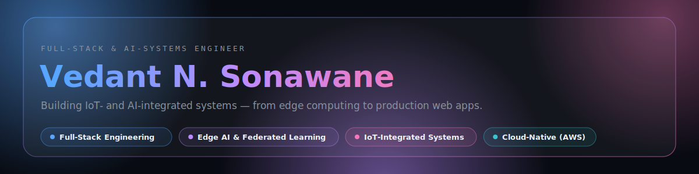
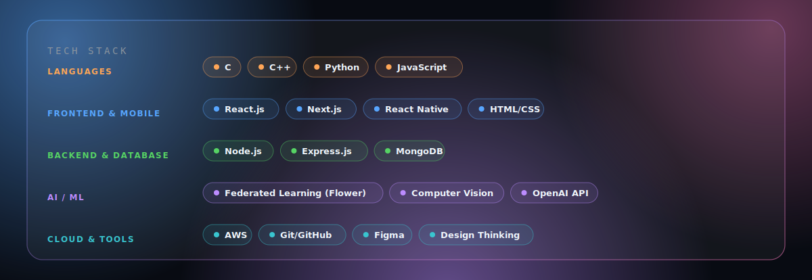
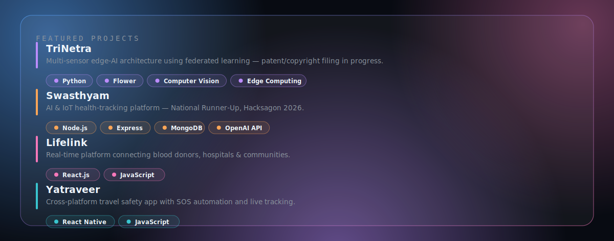

  
<!--
  GITHUB STATS — live, auto-updating widgets, themed to match the banners above.
  These pull real data from your GitHub account. If any of them show a broken
  image icon, it's the shared public instance being overloaded/rate-limited
  (a known, widely-reported issue) — not a problem with this file. Fastest fix:
  fork + self-host on your own free Vercel account, then swap the domain below
  from "github-readme-stats.vercel.app" to your own deployed URL.
-->

  

Profile views: 

